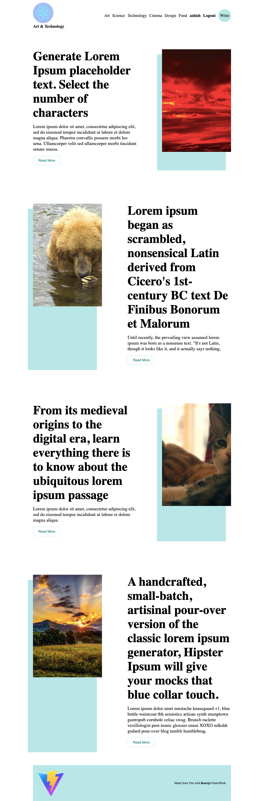
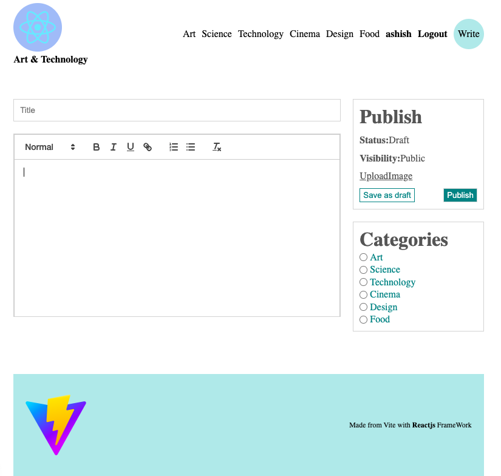

## This is Blog page for Users to share thier Blogs and see what others want to share
 This blog page is fullstack application consist of Frontend( React.js) and 
 Backend( Node.js, ExpressLib) with Database of (MySql);

## Working of this BlogPage

### HomePage
    Includes Every post , Navbar have the category to filter out your prefernce
   

### Post Page
    single post details, user, createdAt and only show edit and delete option, if created by User

   

  #### Update page if its user

  

### Create Post Page
    It's consist field of title, description, category, postImg
   
  
 
  

   
   

    
    
